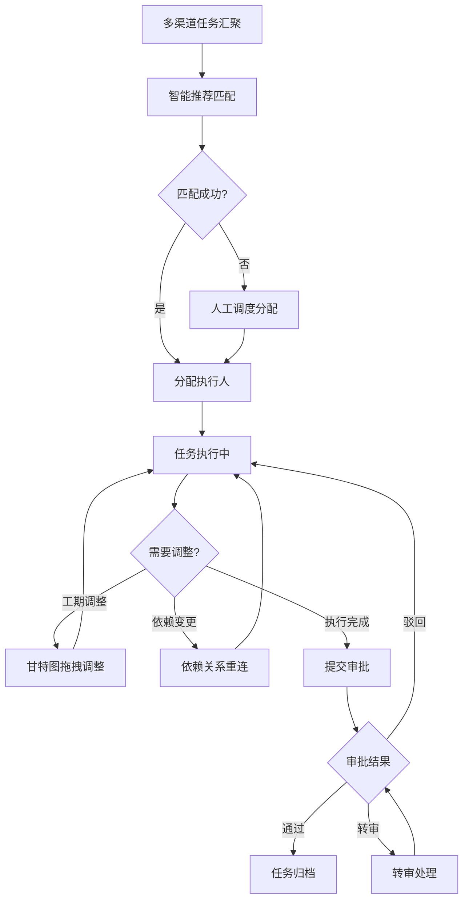
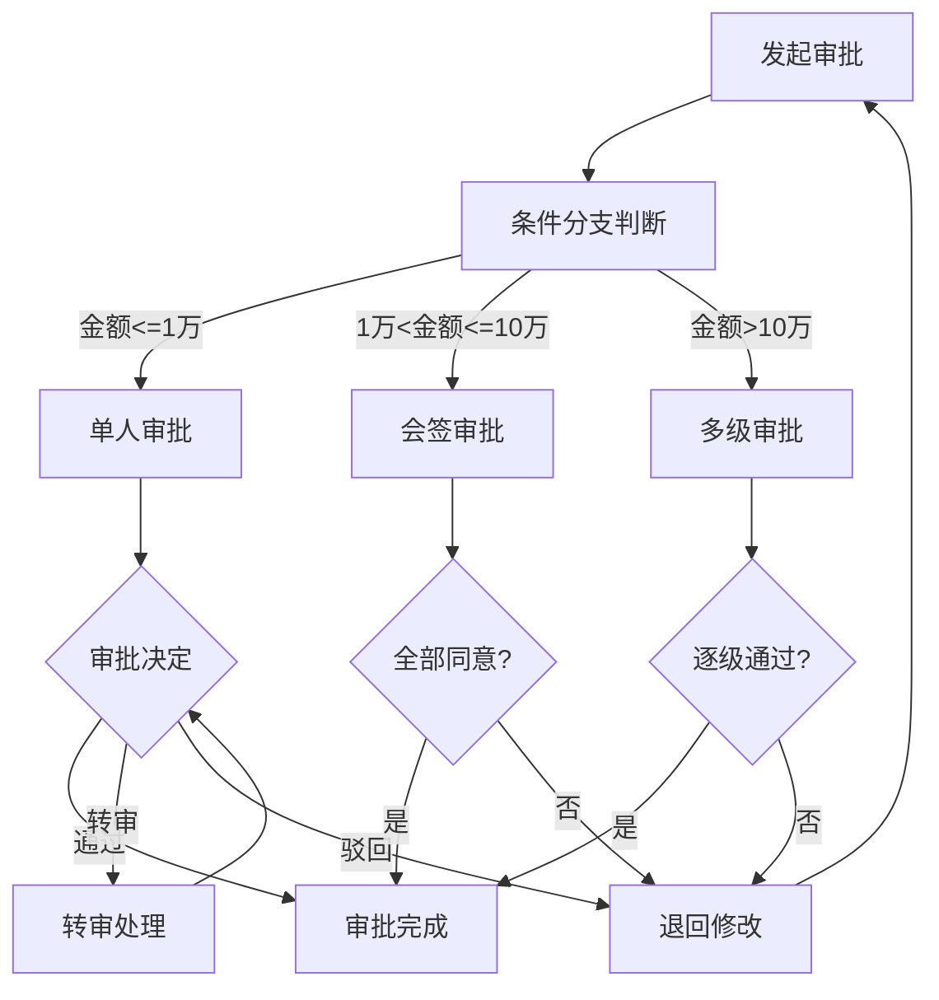

## 1. 产品概述
智能任务协同及资源调度中枢是面向大型企业的全链路协作平台，通过多渠道自动汇聚任务，基于员工技能画像、历史绩效与实时负载的智能算法动态匹配最优执行人，实现从任务创建到闭环的全生命周期管理。
- 解决大型企业跨部门任务调度效率低、资源分配不透明、审批流程僵化等核心痛点
- 目标用户：集团型企业中高层管理者、项目经理、一线执行人员及系统管理员

## 2. 核心功能

### 2.1 用户角色
| 角色 | 注册方式 | 核心权限 |
|------|----------|----------|
| 系统管理员 | 后台分配 | 全局配置、权限管理、组织架构管理、审批流配置 |
| 部门管理者 | 管理员分配 | 部门资源调度、绩效审核、审批处理、团队看板 |
| 项目经理 | 管理员/自注册 | 项目任务分配、甘特图管理、进度跟踪、审批发起 |
| 执行人员 | 管理员/自注册 | 任务接收与执行、工时填报、评论协作、附件管理 |
| 审批人员 | 角色委派 | 审批待办处理、转审、会签 |

### 2.2 功能模块
1. **全局仪表盘**：资源热力图、产能看板、实时数据大屏、关键指标卡片
2. **任务中枢**：多渠道任务汇聚、智能推荐执行人、任务看板、交互式甘特图
3. **审批中心**：审批流引擎、图形化拖拽设计器、条件分支/会签/转审、审批待办列表
4. **绩效分析**：多维自助报表、趋势预测曲线、百万级数据聚合、数据导出
5. **协作空间**：富文本评论、版本化附件管理、@提及通知、消息流
6. **消息中枢**：WebSocket实时推送、变更提醒、审批待办、定向通知
7. **系统管理**：组织架构管理、角色权限配置、数据隔离策略、多语言设置

### 2.3 页面详情
| 页面名称 | 模块名称 | 功能描述 |
|----------|----------|----------|
| 全局仪表盘 | 资源热力图 | 展示各部门/团队实时负载热力图，颜色深浅表示负载程度，支持缩放与钻取 |
| 全局仪表盘 | 产能看板 | 实时刷新的产能利用率卡片，展示可用工时、已分配工时、超载预警 |
| 全局仪表盘 | 关键指标卡片 | 任务完成率、平均响应时间、审批通过率等核心KPI实时展示 |
| 全局仪表盘 | 实时数据流 | 毫秒级更新的活动事件流，展示最新任务创建、状态变更、审批操作等 |
| 任务中枢 | 任务汇聚面板 | 统一展示来自邮件、IM、API等多渠道的待分配任务列表 |
| 任务中枢 | 智能推荐面板 | 基于技能/绩效/负载算法推荐最优执行人，展示匹配度评分与推荐理由 |
| 任务中枢 | 任务看板 | 看板视图（待分配/进行中/待审核/已完成），支持拖拽切换状态 |
| 任务中枢 | 交互式甘特图 | 全生命周期甘特图，支持拖拽调整工期与依赖关系连线 |
| 任务中枢 | 任务详情抽屉 | 侧滑抽屉展示任务完整信息、评论、附件、审批记录 |
| 审批中心 | 审批待办列表 | 待我审批/我发起的/已完成的审批列表，支持筛选与批量处理 |
| 审批中心 | 审批流设计器 | 图形化拖拽界面，支持条件分支、会签、转审节点配置 |
| 审批中心 | 审批详情页 | 审批流程可视化、审批意见填写、转审/加签操作 |
| 绩效分析 | 自助报表 | 多维度数据透视，拖拽字段生成报表，支持筛选与分组 |
| 绩效分析 | 趋势预测 | 历史数据趋势曲线与AI预测区间，百万级数据前端聚合渲染 |
| 绩效分析 | 数据导出 | 报表导出为Excel/PDF，支持定时自动生成 |
| 协作空间 | 评论流 | 富文本编辑器，支持@提及、代码块、图片嵌入 |
| 协作空间 | 附件管理 | 版本化文件管理，支持上传/下载/预览/版本对比 |
| 消息中枢 | 通知中心 | WebSocket实时推送的消息列表，分类展示变更/审批/@提及通知 |
| 消息中枢 | 消息设置 | 通知偏好配置，按类型/渠道设置接收规则 |
| 系统管理 | 组织架构 | 树形组织架构管理，部门/团队/岗位层级配置 |
| 系统管理 | 角色权限 | 多级角色配置，功能权限与数据权限分离管理 |
| 系统管理 | 多语言设置 | 语言包管理，支持动态切换中/英/日等多语言 |

## 3. 核心流程

### 3.1 任务全生命周期流程
任务从多渠道汇聚后，经智能推荐匹配执行人，执行过程中可调整工期与依赖关系，完成后进入审批环节，最终闭环归档。

### 3.2 审批流引擎流程

## 4. 用户界面设计

### 4.1 设计风格
- **主色调**：深邃藏青色(#0F172A)作为基底，搭配翡翠绿(#10B981)作为活力强调色，琥珀橙(#F59E0B)作为警示/高亮色
- **辅助色系**：冷灰阶(Slate系列)构建层次，青蓝渐变(#06B6D4→#3B82F6)用于数据可视化
- **按钮风格**：圆角8px，微浮雕阴影，悬浮态带微妙上浮与发光效果
- **字体**：标题使用DM Sans（几何感现代字体），正文使用Noto Sans SC（中文适配优化）
- **布局风格**：深色系侧边栏导航 + 顶部工具栏，内容区卡片式布局，数据可视化区域留白充足
- **图标风格**：线性图标(lucide-react)，1.5px线宽，与整体几何感统一
- **动效风格**：数据刷新时脉冲呼吸动画，页面切换淡入滑动，拖拽时弹性跟随，审批节点高亮流光

### 4.2 页面设计概览
| 页面名称 | 模块名称 | UI元素 |
|----------|----------|--------|
| 全局仪表盘 | 资源热力图 | 深色背景渐变网格热力图，单元格悬浮显示详情浮层，脉冲动画标记高负载区 |
| 全局仪表盘 | 产能看板 | 环形进度指示器+数字卡片，实时数字翻转动画，超载区琥珀色闪烁预警 |
| 全局仪表盘 | 关键指标 | 玻璃拟态卡片，渐变进度条，微光边框效果 |
| 任务中枢 | 任务看板 | 四列看板布局，卡片带优先级色条，拖拽时卡片半透明+投影加深 |
| 任务中枢 | 甘特图 | 横轴时间刻度尺，纵轴任务条目，依赖关系贝塞尔曲线连线，拖拽手柄 |
| 审批中心 | 审批流设计器 | 画布式编辑区，节点卡片+连接线，左侧组件面板，右侧属性面板 |
| 绩效分析 | 趋势预测 | 深色背景折线图，历史实线+预测虚线，置信区间半透明填充 |
| 协作空间 | 评论流 | 卡片式评论列表，富文本工具栏，头像+时间戳+操作按钮 |

### 4.3 响应式策略
- 桌面优先设计，核心功能在1920x1080及以上分辨率完整呈现
- 1440px以下隐藏侧边栏为图标模式，看板列数自适应
- 1024px以下切换为移动端布局，甘特图简化为列表视图
- 触控优化：拖拽操作增加触控手柄尺寸，双指缩放支持

### 4.4 性能目标
- 千级并发用户实时数据刷新延迟 < 100ms
- 百万级数据点前端聚合渲染帧率 > 30fps
- 页面首次加载 < 2s，路由切换 < 300ms
- 拖拽操作响应延迟 < 16ms（60fps）
