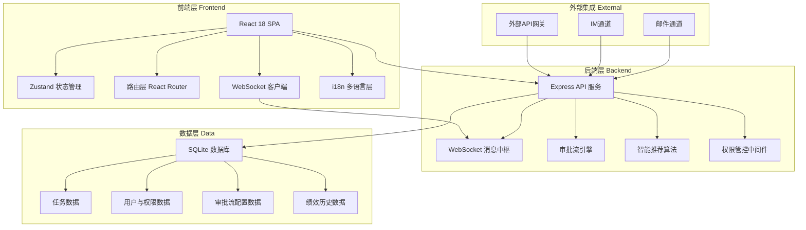
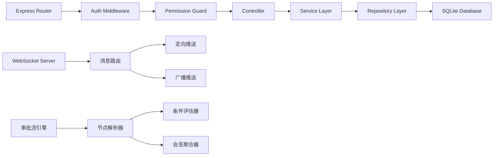

## 1. 架构设计



## 2. 技术说明
- **前端**：React@18 + TailwindCSS@3 + Vite + Zustand + React Router DOM
- **初始化工具**：vite-init (react-express-ts 模板)
- **后端**：Express@4 + TypeScript (ESM)
- **数据库**：SQLite (better-sqlite3)，使用Mock数据填充
- **实时通信**：ws (WebSocket库)，实现消息中枢定向推送
- **图表渲染**：Recharts 用于统计图表，自研Canvas甘特图组件
- **拖拽引擎**：@dnd-kit/core 用于看板与审批流拖拽
- **富文本**：@tiptap/react 富文本编辑器
- **多语言**：i18next + react-i18next
- **图标**：lucide-react

## 3. 路由定义
| 路由 | 用途 |
|------|------|
| `/` | 全局仪表盘 - 资源热力图与产能看板 |
| `/tasks` | 任务中枢 - 任务看板与汇聚面板 |
| `/tasks/gantt` | 甘特图视图 - 任务全生命周期管理 |
| `/tasks/:id` | 任务详情 - 评论、附件、审批记录 |
| `/approvals` | 审批中心 - 待办审批列表 |
| `/approvals/designer` | 审批流设计器 - 图形化拖拽配置 |
| `/approvals/:id` | 审批详情 - 流程可视化与操作 |
| `/performance` | 绩效分析 - 自助报表与趋势预测 |
| `/collaboration/:taskId` | 协作空间 - 评论与附件管理 |
| `/messages` | 消息中枢 - 通知中心 |
| `/admin/org` | 组织架构管理 |
| `/admin/roles` | 角色权限配置 |
| `/admin/i18n` | 多语言设置 |
| `/login` | 登录页面 |

## 4. API 定义

### 4.1 任务相关
```typescript
interface Task {
  id: string
  title: string
  description: string
  source: "email" | "im" | "api" | "manual"
  status: "pending" | "assigned" | "in_progress" | "review" | "completed" | "archived"
  priority: "critical" | "high" | "medium" | "low"
  assigneeId?: string
  creatorId: string
  projectId: string
  startDate: string
  dueDate: string
  estimatedHours: number
  actualHours?: number
  dependencies: string[]
  tags: string[]
  createdAt: string
  updatedAt: string
}

// GET /api/tasks - 获取任务列表
// GET /api/tasks/:id - 获取任务详情
// POST /api/tasks - 创建任务
// PUT /api/tasks/:id - 更新任务
// POST /api/tasks/:id/assign - 智能推荐并分配
// PUT /api/tasks/:id/status - 更新任务状态
```

### 4.2 智能推荐
```typescript
interface Recommendation {
  userId: string
  userName: string
  avatar: string
  matchScore: number
  reasons: string[]
  currentLoad: number
  skillMatch: number
  performanceScore: number
}

// GET /api/recommendations?taskId=:id - 获取任务推荐执行人
```

### 4.3 审批相关
```typescript
interface ApprovalFlow {
  id: string
  name: string
  nodes: ApprovalNode[]
  edges: ApprovalEdge[]
  version: number
  createdAt: string
}

interface ApprovalNode {
  id: string
  type: "start" | "end" | "approval" | "condition" | "countersign" | "transfer"
  label: string
  config: Record<string, unknown>
  position: { x: number; y: number }
}

interface ApprovalEdge {
  id: string
  source: string
  target: string
  condition?: string
  label?: string
}

// GET /api/approvals - 获取审批列表
// GET /api/approvals/:id - 获取审批详情
// POST /api/approvals - 发起审批
// PUT /api/approvals/:id/action - 审批操作（通过/驳回/转审/加签）
// GET /api/approval-flows - 获取审批流模板列表
// POST /api/approval-flows - 创建审批流模板
// PUT /api/approval-flows/:id - 更新审批流模板
```

### 4.4 仪表盘数据
```typescript
interface DashboardData {
  heatmap: HeatmapCell[]
  capacityCards: CapacityCard[]
  kpiMetrics: KPIMetric[]
  recentEvents: ActivityEvent[]
}

interface HeatmapCell {
  departmentId: string
  departmentName: string
  loadPercentage: number
  totalCapacity: number
  usedCapacity: number
  teamDetails: HeatmapCell[]
}

// GET /api/dashboard - 获取仪表盘数据（支持WebSocket增量推送）
```

### 4.5 绩效分析
```typescript
interface PerformanceReport {
  dimensions: string[]
  metrics: MetricData[]
  trendData: TrendPoint[]
  predictionData: PredictionInterval[]
}

// GET /api/performance/report - 获取绩效报表
// GET /api/performance/trend - 获取趋势预测数据
// POST /api/performance/export - 导出报表
```

### 4.6 协作与消息
```typescript
interface Comment {
  id: string
  taskId: string
  userId: string
  content: string
  mentions: string[]
  createdAt: string
  updatedAt: string
}

interface Attachment {
  id: string
  taskId: string
  fileName: string
  fileSize: number
  version: number
  uploadedBy: string
  uploadedAt: string
}

interface WSMessage {
  type: "task_update" | "approval_pending" | "comment" | "mention" | "system"
  payload: Record<string, unknown>
  timestamp: string
  targetUsers?: string[]
}

// GET /api/tasks/:taskId/comments - 获取评论列表
// POST /api/tasks/:taskId/comments - 添加评论
// GET /api/tasks/:taskId/attachments - 获取附件列表
// POST /api/tasks/:taskId/attachments - 上传附件
// GET /api/notifications - 获取通知列表
// WebSocket /ws - 实时消息推送连接
```

## 5. 服务端架构图



## 6. 数据模型

### 6.1 数据模型定义

```mermaid
erDiagram
    "User" ||--o{ "Task" : "creates"
    "User" ||--o{ "Task" : "assigned_to"
    "User" }|--| "Department" : "belongs_to"
    "User" }|--| "Role" : "has"
    "Task" ||--o{ "Comment" : "has"
    "Task" ||--o{ "Attachment" : "has"
    "Task" ||--o{ "TaskDependency" : "depends_on"
    "Task" }|--| "Project" : "belongs_to"
    "ApprovalFlow" ||--o{ "ApprovalInstance" : "instantiates"
    "ApprovalInstance" ||--o{ "ApprovalRecord" : "has"
    "Department" ||--o{ "Department" : "parent_of"
    "User" ||--o{ "PerformanceRecord" : "has"
    "Role" ||--o{ "Permission" : "has"

    User {
        string id PK
        string name
        string email
        string avatar
        string departmentId FK
        string roleId FK
        number loadPercentage
        number performanceScore
        string skills "JSON array"
    }

    Task {
        string id PK
        string title
        string description
        string source
        string status
        string priority
        string assigneeId FK
        string creatorId FK
        string projectId FK
        string startDate
        string dueDate
        number estimatedHours
        number actualHours
        string tags "JSON array"
    }

    Department {
        string id PK
        string name
        string parentId FK
        number capacity
    }

    Role {
        string id PK
        string name
        string permissions "JSON array"
        string dataScope
    }

    ApprovalFlow {
        string id PK
        string name
        string nodes "JSON"
        string edges "JSON"
        number version
    }

    ApprovalInstance {
        string id PK
        string flowId FK
        string taskId FK
        string status
        string currentNodeId
    }

    ApprovalRecord {
        string id PK
        string instanceId FK
        string nodeId
        string userId FK
        string action
        string comment
    }

    Comment {
        string id PK
        string taskId FK
        string userId FK
        string content
        string mentions "JSON array"
    }

    Attachment {
        string id PK
        string taskId FK
        string fileName
        number fileSize
        number version
        string uploadedBy FK
    }

    PerformanceRecord {
        string id PK
        string userId FK
        string period
        number score
        string metrics "JSON"
    }

    Project {
        string id PK
        string name
        string description
        string managerId FK
    }

    TaskDependency {
        string id PK
        string taskId FK
        string dependsOnId FK
        string type
    }

    Permission {
        string id PK
        string resource
        string action
        string scope
    }
```

### 6.2 数据定义语言

```sql
CREATE TABLE departments (
  id TEXT PRIMARY KEY,
  name TEXT NOT NULL,
  parent_id TEXT REFERENCES departments(id),
  capacity INTEGER DEFAULT 100
);

CREATE TABLE roles (
  id TEXT PRIMARY KEY,
  name TEXT NOT NULL,
  permissions TEXT DEFAULT '[]',
  data_scope TEXT DEFAULT 'self'
);

CREATE TABLE users (
  id TEXT PRIMARY KEY,
  name TEXT NOT NULL,
  email TEXT UNIQUE NOT NULL,
  avatar TEXT,
  department_id TEXT REFERENCES departments(id),
  role_id TEXT REFERENCES roles(id),
  load_percentage REAL DEFAULT 0,
  performance_score REAL DEFAULT 0,
  skills TEXT DEFAULT '[]',
  password_hash TEXT NOT NULL
);

CREATE TABLE projects (
  id TEXT PRIMARY KEY,
  name TEXT NOT NULL,
  description TEXT,
  manager_id TEXT REFERENCES users(id)
);

CREATE TABLE tasks (
  id TEXT PRIMARY KEY,
  title TEXT NOT NULL,
  description TEXT,
  source TEXT DEFAULT 'manual',
  status TEXT DEFAULT 'pending',
  priority TEXT DEFAULT 'medium',
  assignee_id TEXT REFERENCES users(id),
  creator_id TEXT REFERENCES users(id),
  project_id TEXT REFERENCES projects(id),
  start_date TEXT,
  due_date TEXT,
  estimated_hours REAL DEFAULT 0,
  actual_hours REAL DEFAULT 0,
  tags TEXT DEFAULT '[]',
  created_at TEXT DEFAULT (datetime('now')),
  updated_at TEXT DEFAULT (datetime('now'))
);

CREATE TABLE task_dependencies (
  id TEXT PRIMARY KEY,
  task_id TEXT REFERENCES tasks(id) ON DELETE CASCADE,
  depends_on_id TEXT REFERENCES tasks(id) ON DELETE CASCADE,
  type TEXT DEFAULT 'finish_to_start'
);

CREATE TABLE approval_flows (
  id TEXT PRIMARY KEY,
  name TEXT NOT NULL,
  nodes TEXT NOT NULL,
  edges TEXT NOT NULL,
  version INTEGER DEFAULT 1,
  created_at TEXT DEFAULT (datetime('now'))
);

CREATE TABLE approval_instances (
  id TEXT PRIMARY KEY,
  flow_id TEXT REFERENCES approval_flows(id),
  task_id TEXT REFERENCES tasks(id),
  status TEXT DEFAULT 'pending',
  current_node_id TEXT,
  created_at TEXT DEFAULT (datetime('now'))
);

CREATE TABLE approval_records (
  id TEXT PRIMARY KEY,
  instance_id TEXT REFERENCES approval_instances(id),
  node_id TEXT NOT NULL,
  user_id TEXT REFERENCES users(id),
  action TEXT NOT NULL,
  comment TEXT,
  created_at TEXT DEFAULT (datetime('now'))
);

CREATE TABLE comments (
  id TEXT PRIMARY KEY,
  task_id TEXT REFERENCES tasks(id) ON DELETE CASCADE,
  user_id TEXT REFERENCES users(id),
  content TEXT NOT NULL,
  mentions TEXT DEFAULT '[]',
  created_at TEXT DEFAULT (datetime('now')),
  updated_at TEXT DEFAULT (datetime('now'))
);

CREATE TABLE attachments (
  id TEXT PRIMARY KEY,
  task_id TEXT REFERENCES tasks(id) ON DELETE CASCADE,
  file_name TEXT NOT NULL,
  file_size INTEGER DEFAULT 0,
  version INTEGER DEFAULT 1,
  uploaded_by TEXT REFERENCES users(id),
  uploaded_at TEXT DEFAULT (datetime('now'))
);

CREATE TABLE performance_records (
  id TEXT PRIMARY KEY,
  user_id TEXT REFERENCES users(id),
  period TEXT NOT NULL,
  score REAL DEFAULT 0,
  metrics TEXT DEFAULT '{}',
  created_at TEXT DEFAULT (datetime('now'))
);

CREATE TABLE notifications (
  id TEXT PRIMARY KEY,
  user_id TEXT REFERENCES users(id),
  type TEXT NOT NULL,
  title TEXT NOT NULL,
  content TEXT,
  read INTEGER DEFAULT 0,
  created_at TEXT DEFAULT (datetime('now'))
);

CREATE INDEX idx_tasks_status ON tasks(status);
CREATE INDEX idx_tasks_assignee ON tasks(assignee_id);
CREATE INDEX idx_tasks_project ON tasks(project_id);
CREATE INDEX idx_notifications_user ON notifications(user_id, read);
CREATE INDEX idx_approval_instances_status ON approval_instances(status);
